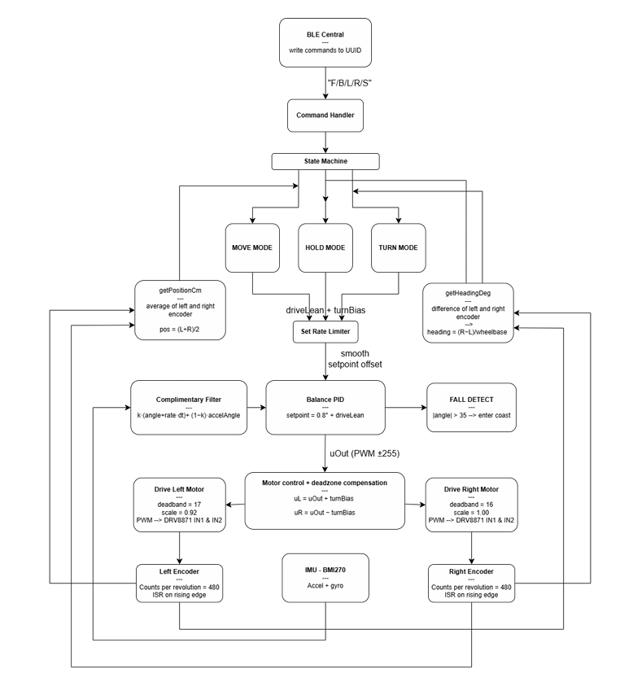

# Self-Balancing Robot with BLE Control
Arduino Nano 33 BLE Sense running a PID balance controller on a BMI270 IMU, with Bluetooth Low Energy control from a Flutter iOS app. Includes yaw correction, ramp traversal via gyroscope spike detection, and quadrature encoder odometry.

---

## Demo

<table>
    <tr>
          <td align="center"><b>Stationary Balance</b>b></td>td>
          <td align="center"><b>Forward / Back</b>b></td>td>
          <td align="center"><b>Turning</b>b></td>td>
    </tr>tr>
    <tr>
          <td>
                  <figure><video src="https://github.com/user-attachments/assets/91283d49-3aaa-4c88-b376-6bd14fcaf858" autoplay loop muted playsinline width="250"></video>video></figure>figure>
          </td>td>
          <td>
                  <figure><video src="https://github.com/user-attachments/assets/19c978ff-1719-4647-aa42-119d8a422805" autoplay loop muted playsinline width="250"></video>video></figure>figure>
          </td>td>
          <td>
                  <figure><video src="https://github.com/user-attachments/assets/8aa021a6-f164-49ae-b7fd-ad5f9f7b9121" autoplay loop muted playsinline width="250"></video>video></figure>figure>
          </td>td>
    </tr>tr>
</table>table>

---

## System Overview

| Component | Detail |
|-----------|--------|
| MCU | Arduino Nano 33 BLE Sense |
| IMU | BMI270 (onboard) — pitch angle via complementary filter |
| Motors | DC gear motors with DRV8871DDA H-bridge |
| Encoders | Quadrature encoders, voltage-divided to 3.3 V (27 kΩ / 10 kΩ) |
| BLE App | Flutter iOS app (custom GATT service) |
| Loop rate | ~100 Hz (IMU-gated) |

---

## Key Technical Features

### PID Balance Controller
- Complementary filter fuses gyroscope and accelerometer: `angle = 0.75 × (angle + gyro·dt) + 0.25 × accel_angle`
- - Tuned gains: `Kp = 6.9`, `Ki = 100`, `Kd = 0.7` with a static lean offset `BASE_OFFSET = 0.9°`
  - - Left motor scale factor (`LEFT_MOTOR_SCALE = 0.92`) and asymmetric deadbands (`DB_L = 17`, `DB_R = 16`) compensate for hardware asymmetry
   
    - ### Yaw Correction
    - - Per-loop encoder delta method: `diff = dL - dR` with ±1 count deadzone
      - - Three-way gain split by motion state — `YAW_KP_FWD = 0.06`, `YAW_KP_BACK = 0.02`, `YAW_KP_STILL = 0.03` — prevents balance wobble coupling during turns
        - - Heading-hold variant uses a low-pass filtered heading error (`YAW_LPF = 0.02`) for smoother straight-line driving
         
          - ### BLE Control (GATT)
          - - Custom 128-bit service UUID with a single writable characteristic
            - - Commands: `FORWARD`, `BACKWARD`, `LEFT`, `RIGHT`, `STOP`
              - - Flutter app deployed via Xcode to iOS; service/characteristic UUIDs hardcoded on both ends
               
                - ### Quadrature Encoder Odometry
                - - Pin assignments: `LEFT_ENC_A=7`, `LEFT_ENC_B=8`, `RIGHT_ENC_A=2`, `RIGHT_ENC_B=4`
                  - - Both encoders increment together for straight motion; `distance = (encL + encR) / 2`, `rotation = encL − encR`
                    - - `COUNTS_PER_CM ≈ 19.2`
                     
                      - ---
       
                      ## Hardware
       
                      | Pin | Function |
                      |-----|----------|
                      | D2, D4 | Right encoder A/B (via 27 kΩ/10 kΩ voltage divider) |
                      | D7, D8 | Left encoder A/B (via 27 kΩ/10 kΩ voltage divider) |
                      | D3, D5 | Right motor IN1/IN2 (PWM) |
                      | D6, D9 | Left motor IN1/IN2 (PWM) |
       
                      Four voltage dividers step encoder signals from 5 V motor supply down to 3.24 V (safe for the Nano 33's 3.3 V GPIO).
       
                      ---
       
                      ## Circuit Schematic
       
                      
       
                      Arduino Nano 33 BLE Sense drives two independent DRV8871DDA single H-bridge channels (one per motor) directly from the 9.6–11 V battery rail through a fuse. Each motor's quadrature encoder outputs are stepped down from the motor supply voltage to 3.3 V via a 27 kΩ / 10 kΩ resistor divider before connecting to the Nano's GPIO.
       
                      ---
       
                      ## Software Architecture
       
                      
       
                      BLE commands from the Flutter app write to a GATT characteristic, which dispatches into a state machine with three modes — **MOVE**, **HOLD**, and **TURN**. The balance loop runs at ~100 Hz: a complementary filter produces the pitch angle, which feeds a PID controller whose output drives both motors through deadband compensation. Encoders (ISR on rising edge, 480 counts/rev) feed back into position and heading estimates used by the state machine for distance control and yaw correction.
       
                      ---
       
                      ## Repository Structure
       
                      ```
                      Self-Balancing-Robot-BLE/
                      ├── firmware/
                      │   └── self_balancing_robot_final.ino   # PID loop, BLE handler, ramp state machine
                      ├── docs/
                      │   ├── schematic.png                    # KiCad circuit schematic
                      │   └── flowchart.png                    # Software architecture diagram
                      └── README.md
                      ```
       
                      ## BLE iOS App
       
                      The robot is controlled via a Flutter iOS app using a custom GATT service. The app was built on top of [Mohamadol/Flutter_Arduino_Bluetooth](https://github.com/Mohamadol/Flutter_Arduino_Bluetooth), adapted to match the robot's service/characteristic UUIDs and command set (`FORWARD`, `BACKWARD`, `LEFT`, `RIGHT`, `STOP`).
       
                      ---
       
                      ## PID Tuning Notes
       
                      | Parameter | Value | Purpose |
                      |-----------|-------|---------|
                      | `Kp` | 6.9 | Proportional — main restoring force |
                      | `Ki` | 100 | Integrates out steady-state lean |
                      | `Kd` | 0.7 | Damps oscillation |
                      | `BASE_OFFSET` | 0.9° | Static CoM lean correction |
                      | `TAU` | 0.75 | Complementary filter gyro weight |
       
                      Gains were tuned iteratively at 10.43 V battery voltage; performance degrades below ~9.5 V as motor response becomes nonlinear.
          </td>
          </td>
    </tr>
    </tr>
</table>
